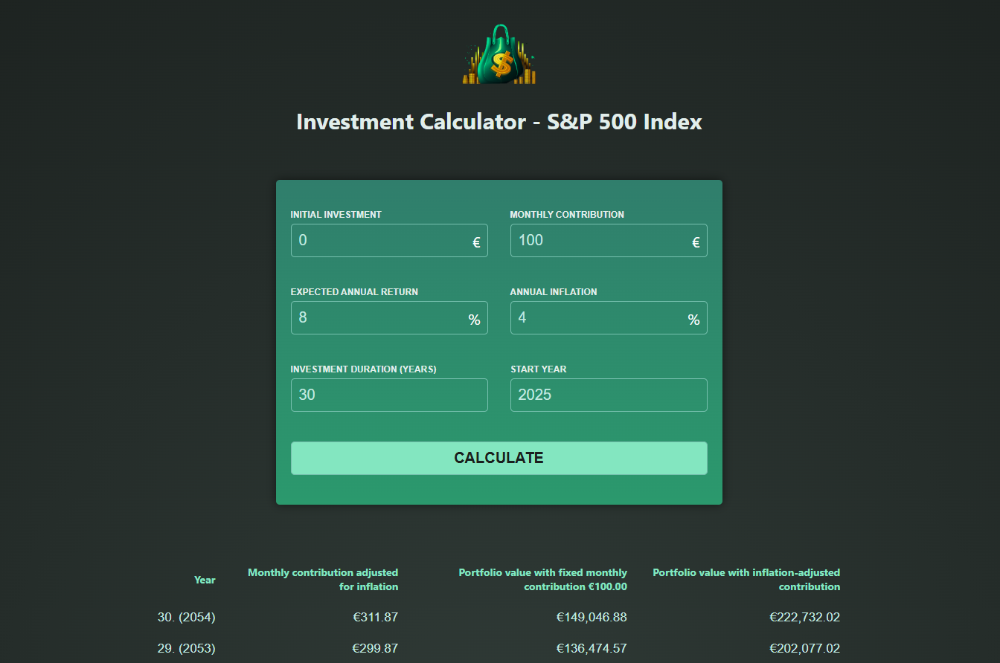

# Investment Calculator (Angular App)

[Live Demo](https://lemonrick.github.io/investment-calculator/)

```bash
npm install
```

### Start the app in development mode (hot-code reloading, error reporting, etc.)
```bash
npm start
```

<p>

</p>
